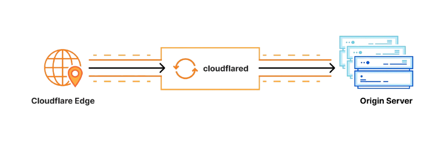

# Mine-Server

## Powered by Paper Server


Welcome to the Mine-Server project! This repository contains everything you need to set up and run your own Minecraft server using PaperMC and Cloudflared.

`cloudflared` is a tool from Cloudflare that allows you to create a secure tunnel between your Minecraft server and Cloudflare's network. This protects you from DDoS attacks and hides your server's IP address, making it less vulnerable to hacking.

### How it works:

1. **Secure Tunnel**: `cloudflared` establishes an encrypted tunnel that redirects traffic to your Minecraft server. This means that the traffic passes through Cloudflare's infrastructure, which has several security measures in place.

2. **DDoS Protection**: When using the tunnel, your connection benefits from Cloudflare's DDoS protections. If an attack does occur, Cloudflare can mitigate the malicious traffic before it reaches your server.



## Table of Contents
- [Prerequisites](#prerequisites)
- [Adding Plugins](#adding-plugins)
- [Configuring the Server](#configuring-the-server)
- [Running the Server](#running-the-server)

## Prerequisites

All prerequisites are installed by `start.sh` or `start.bat`.


## Adding Plugins

To add plugins to your server, place the `.jar` files in the `plugins` directory:

```

```

## Configuring the Server

The server can be configured by editing the  file. Here, you can adjust various settings such as server port, max players, and more.

## Running the Server

### Windows

To run the server on Windows, execute the `start.bat` script. This will also install necessary dependencies and start Cloudflare:

```bash
start.bat
```

### Linux

For Linux users, run the `start.sh` script:

```bash
bash start.sh
```

Feel free to reach out if you have any questions or need assistance!
